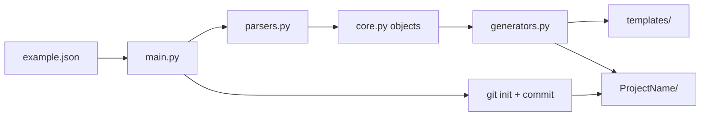

# Developer Guide — Digital IC Environment Builder

This document is for **human developers and AI agents** working on the tool itself (not for end users running the generator). Read this before changing code under `development/`.

---

## What this tool does

The Digital IC Environment Builder takes a **JSON entity file** describing one hardware block (name + port list) and scaffolds a ready-to-use project:

- SystemVerilog RTL module
- SystemVerilog testbench
- QuestaSim/ModelSim run scripts
- Documentation copy of the entity spec
- Git repository with an initial commit

The user runs `main.py` from the **repo root**. All generator logic lives in **`development/`**.

---

## Repository layout

```
Digital_Environment_Automation/
├── main.py              ← entry point (orchestration only)
├── example.json         ← sample entity input
├── README.md            ← user-facing documentation
├── todolist.txt         ← phased development roadmap
├── Example/             ← sample generated output (do not edit by hand for tool dev)
└── development/         ← all tool source code (you are here)
    ├── readme_dev.md    ← this file
    ├── core.py          ← data model
    ├── parsers.py       ← JSON → Project
    ├── generators.py    ← Project → output folders
    ├── app.py           ← legacy monolith (reference only, do not extend)
    └── templates/       ← file templates consumed by generators
```

**Rule:** Keep the repo root clean. New Python modules, templates, and tests belong under `development/` unless there is a strong reason to expose something at root (currently only `main.py`).

---

## Architecture overview

The tool follows a simple **parse → model → generate** pipeline:



### Data flow (step by step)

| Step | Where | What happens |
|------|-------|--------------|
| 1 | `main.py` | Receives JSON path; adds `development/` to `sys.path` |
| 2 | `parsers.py` | Reads JSON, builds `Project`, `Module`, `Signal` objects |
| 3 | `parsers.py` | Attaches generator instances to `project.generators` |
| 4 | `main.py` | Creates `<ProjectName>/` under current working directory |
| 5 | `main.py` | Runs `git init`, copies `.gitignore` from template |
| 6 | `generators.py` | Each generator writes one subfolder under the project root |
| 7 | `main.py` | `git add --all` and initial commit |

---

## File reference

### `../main.py` (repo root)

**Role:** Thin orchestrator. No business logic.

Responsibilities:
- Import `parse_json` from `development/parsers.py`
- Create output directory named after the JSON `"Name"` field
- Initialize git and write `.gitignore`
- Loop over `project.modules` × `project.generators` and call `generate()`
- Create the first git commit

Does **not** contain: port formatting, template content, or JSON parsing.

---

### `core.py` — data model

**Role:** In-memory representation of a design. **No file I/O.**

| Class | Purpose |
|-------|---------|
| `Signal` | One port: name, direction, width, init value |
| `Module` | One RTL block; holds a list of `Signal` objects |
| `Project` | Top container: name, source JSON path, modules, generator list |
| `BaseGenerator` | Abstract base; all output writers subclass this |

**Key methods on `Module`:**

| Method | Used by | Returns |
|--------|---------|---------|
| `design_ports()` | `RTLGenerator` | SV port declarations + dummy output assigns |
| `tb_ports()` | `TestbenchGenerator` | TB signal declarations + input init lines |

**Naming convention:** Inputs are prefixed `i_`, outputs `o_` in generated SV to avoid internal/name clashes.

**When to edit `core.py`:**
- Adding new fields to the entity model (e.g. clock domains, parameters)
- Changing how ports are formatted for RTL or testbench
- Adding helper methods shared by multiple generators

---

### `parsers.py` — input layer

**Role:** Convert JSON entity files into `Project` objects and wire up generators.

**Entry point:** `parse_json(path: str) -> Project`

**Expected JSON format:**

```json
{
  "Name": "Example",
  "Signals": [
    {"name": "data_bus", "direction": "input",  "width": 32, "init": 0},
    {"name": "code_bus", "direction": "output", "width": 32, "init": 0}
  ]
}
```

| Field | Required | Default | Notes |
|-------|----------|---------|-------|
| `Name` | no | `"Unnamed"` | Becomes project folder and module name |
| `Signals[].name` | yes | — | Skipped if missing |
| `Signals[].direction` | yes | — | `"input"` or `"output"` |
| `Signals[].width` | no | `1` | Bit width |
| `Signals[].init` | no | `0` | Hex init for outputs and TB inputs |

**Generator registration** happens here. To add a new output folder, append a new generator instance to `project.generators` in `parse_json()`.

---

### `generators.py` — output layer

**Role:** Write files to disk using templates from `templates/`.

All generators implement:

```python
def generate(self, project: Project, module: Module, root: str) -> None
```

| Class | Output folder | Output files |
|-------|---------------|--------------|
| `RTLGenerator` | `rtl/` | `<ModuleName>.sv` |
| `TestbenchGenerator` | `testbench/` | `tb_<ModuleName>.sv` |
| `SimulationGenerator` | `sim/` | `start.do`, `reset.do`, `wave.do`, `done.do`, `sourcefile.txt` |
| `DocsGenerator` | `docs/` | `readme.txt` (copy of source JSON) |

**Template engine:** Python `string.Template` with `$placeholder` syntax. For literal `$` in templates (e.g. `$stop` in SV), use `$$`.

**Adding a new generator (checklist):**

1. Subclass `BaseGenerator` in `generators.py`
2. Add template file(s) under `templates/`
3. Register the instance in `parsers.py` → `project.generators`
4. Update this document and `../todolist.txt` if part of a planned phase

---

### `templates/` — static file skeletons

**Role:** Source-of-truth for generated file content. Generators only substitute dynamic parts.

| File | Placeholders | Used by |
|------|--------------|---------|
| `rtl.sv` | `$header`, `$name`, `$interface_list`, `$assign_list` | `RTLGenerator` |
| `testbench.sv` | `$header`, `$tb_name`, `$module_name`, `$signals_list`, `$init_list` | `TestbenchGenerator` |
| `start.do` | `$tb_name` | `SimulationGenerator` |
| `reset.do`, `wave.do`, `done.do` | none (copied as-is) | `SimulationGenerator` |
| `sourcefile.txt` | `$module_name`, `$tb_name` | `SimulationGenerator` |
| `gitignore` | none | `main.py` (written to project root) |

Edit templates when changing **structure** of generated files. Edit `core.py` when changing **how port lists are built**.

---

### `app.py` — legacy reference

**Role:** Original single-file implementation (pre-refactor). Contains the same flow as the modular version but as one script.

**Status:** Do not extend. Use only as historical reference when unsure how the original tool behaved. All new work goes into `core.py`, `parsers.py`, and `generators.py`.

---

## Generated project structure

Running `python main.py example.json` from the repo root produces:

```
Example/
├── .gitignore
├── rtl/
│   └── Example.sv
├── testbench/
│   └── tb_Example.sv
├── sim/
│   ├── start.do       ← compile, elaborate, run
│   ├── reset.do       ← recompile + restart
│   ├── wave.do        ← refresh waves
│   ├── done.do        ← quit simulator
│   └── sourcefile.txt ← paths to rtl + testbench sources
└── docs/
    └── readme.txt     ← copy of input JSON
```

**QuestaSim usage** (from inside `Example/sim/`):

```
do start.do    # first run
do reset.do    # after RTL/TB edits
do done.do     # close
```

---

## Development roadmap

See `../todolist.txt` for phased plans:

| Phase | Status | Focus |
|-------|--------|-------|
| 1 | Done | Core model, parsers, RTL/TB generators, templates |
| 2 | Done | Simulation scripts (`SimulationGenerator`) |
| 3 | Planned | Synthesis & formal verification flows |
| 4 | Planned | Hierarchical submodules in JSON |
| 5 | Planned | Config file, multi-vendor support, CLI flags |
| 6 | Planned | Packaging, polish, pip install |

When implementing a new phase, prefer **one new generator class + templates** over growing `main.py`.

---

## Conventions for contributors

### Human developers

1. Read this file and `../todolist.txt` before starting work.
2. Keep `main.py` thin; put logic in the appropriate `development/` module.
3. Match existing naming: lowercase folder names (`rtl`, `testbench`, `sim`, `docs`).
4. Test with: `python main.py example.json` then inspect `Example/`.
5. Do not commit generated `Example/` changes unless intentionally updating the sample.

### AI agents

1. **Start here** (`readme_dev.md`) and read the target module before editing.
2. **Do not** refactor unrelated files or move things out of `development/` without being asked.
3. **Extend** via new `BaseGenerator` subclasses rather than inline file writes in `main.py`.
4. **Preserve** the parse → model → generate separation:
   - Input parsing → `parsers.py`
   - Data structures → `core.py`
   - Disk output → `generators.py` + `templates/`
5. **Update this file** when adding generators, templates, or changing the JSON schema.
6. **Check** `app.py` only for behavioral reference; never add features there.

---

## Dependency graph (imports)

```
main.py
  └── parsers.py
        ├── core.py
        └── generators.py
              └── core.py
```

No circular imports. `generators.py` resolves templates relative to its own directory (`__file__`).

---

## Quick debugging guide

| Symptom | Likely cause | Check |
|---------|--------------|-------|
| `ModuleNotFoundError: parsers` | Running script from wrong cwd or path | Run from repo root; `main.py` adds `development/` to path |
| Empty or missing ports in SV | JSON signal missing `name`/`direction` | `example.json`, `parsers.py` skip logic |
| `$stop` errors in generated SV | Unescaped `$` in template | Use `$$stop` in `templates/testbench.sv` |
| Sim can't find RTL | Wrong paths in `sourcefile.txt` | `templates/sourcefile.txt` must use `../rtl/` and `../testbench/` |
| Git commit fails | No git installed or repo already exists with conflicts | Run outside sandbox; delete old `Example/.git` to regenerate |

---

## Version history (modular codebase)

| Version | Description |
|---------|-------------|
| 1.0–1.2 | Monolith `app.py`, txt then JSON input |
| 1.3+ | Modular split: `core`, `parsers`, `generators`, `templates` |
| 1.4+ | Git init, docs folder, lowercase output dirs (`rtl`, `sim`, `testbench`) |
| Current | Source under `development/`, `main.py` at repo root |

For user-facing usage, see `../README.md`.
